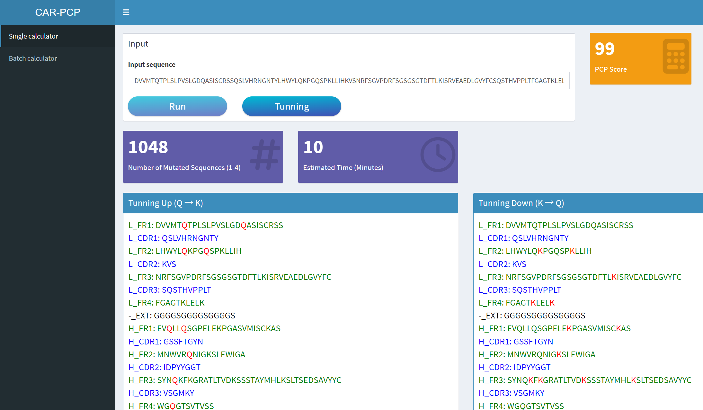
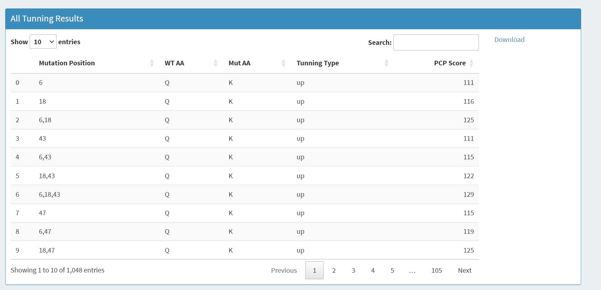
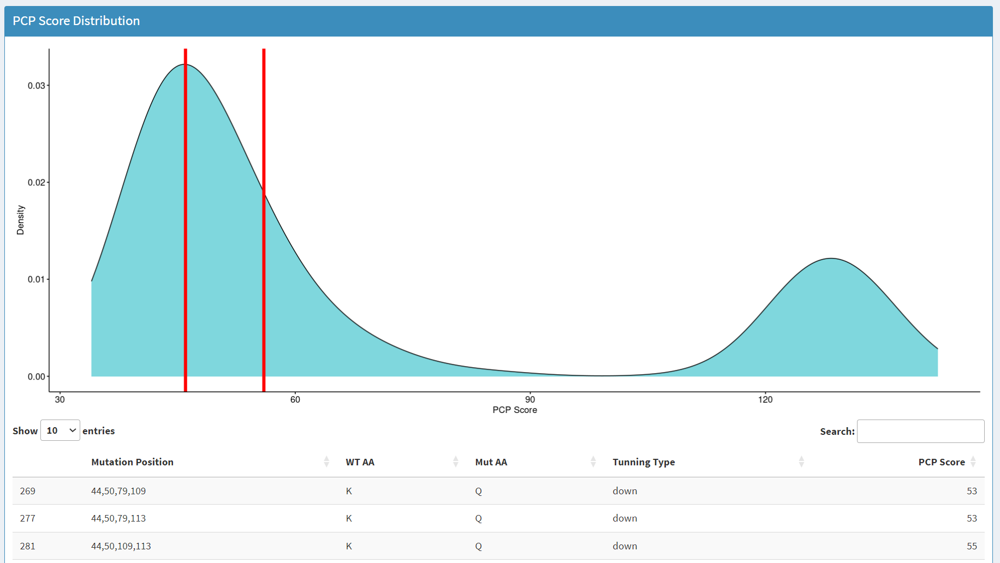
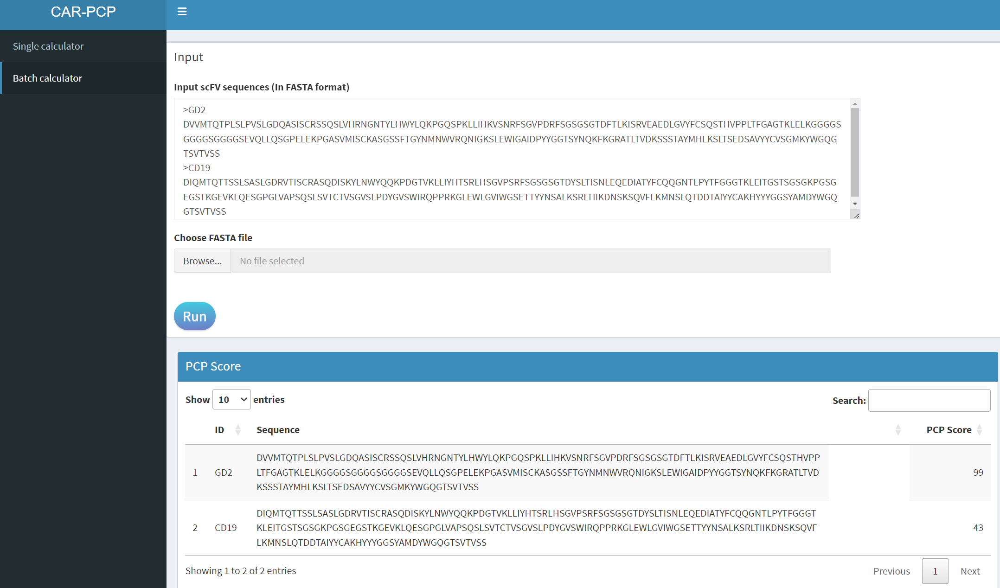

# PCP-AIOptimizer

Fine-tuned model based on ESM2-8M for PCP calculation.

### Dependency

- pytorch 2.0.0 
- numpy 1.26.0
- pandas 1.5.3 
- tqdm 4.65.0 
- transformers 4.27.1

The model weight is saved in `data/checkpoint-22176`, user can predict PCP score by input `csv` file with `seq` column:

```shell
python pre_pcp.py -i input.csv -o input_pre.csv -m data/checkpoint-checkpoint-22176/
```

The `pre` column in output file is `log2(PCP)`, thus can be convert to PCP by `round(2^(input_pre$pre))`.

### Web interface

The web interface of PCP-AIOptimizer consists of two part: single-mode and batch mode. 
In single mode, user can input one sequence and calculate its PCP score. Then system show number of mutated sequences and position of tuning mutations (k-q for tuning down, q-k for tuning up). Once user click tuning button, the PCP prediction of mutated sequences is running. After completed, the tuning results are shown as table and the distribution of PCP scores are also drawn. User can select specific range of PCP score in the density plot and corresponding results are listed in table below. <br />
In batch mode, user can input multiple sequence in text box or in `Fasta` file, the predicted results are shown as table.







